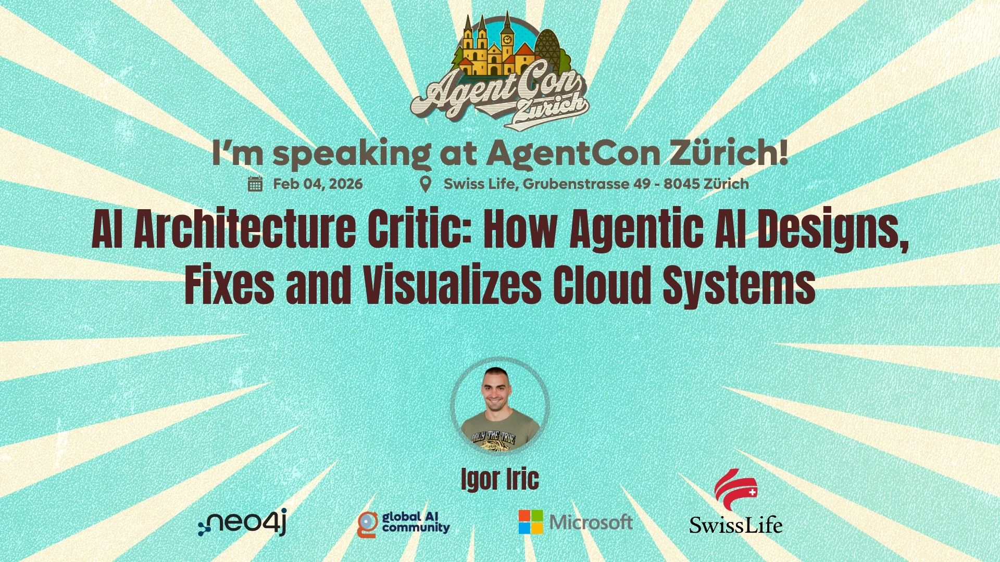

# AI Architecture Critic: How Agentic AI Designs, Fixes and Visualizes Cloud Systems

<div align="center">




**AgentCon Zürich | Workshop Wed 1:30 pm - 3:00 pm**

**Igor Iric** | AI Architecture Critic Workshop

</div>

---

> **Conference-ready demonstration of Agentic AI with real-time documentation grounding using Microsoft Agent Framework**

## 📢 About This Workshop

In this session, I show how **Agentic AI** can radically change the way we design, evaluate and visualize cloud systems using the **Microsoft Agent Framework**.

I will demonstrate a lightweight multi-agent workflow, an **AI Architecture Critic & Fixer** and how it collaborates with my open-source project **Cloud Visualizer Pro**, which generates Azure-ready architectures directly from text or rough sketches.

**Attendees will learn:**
- ✅ How to build practical Agentic workflows in **<150 lines of code**
- ✅ How AI can detect architectural risks, security gaps and misconfigurations
- ✅ How agents can auto-improve designs using Azure best practices
- ✅ How to generate visual and deployable IaC (Bicep/Terraform) from text
- ✅ How enterprises can integrate this pattern into real engineering teams

This talk is perfect for developers, architects and engineering leaders who want to see Agentic AI applied to **real cloud problems, not theoretical demos**.

---

## 🎯 What This Demo Shows

**Key Concept**: Agentic AI is not just reasoning — it's **reasoning grounded in real documentation**.

This demo showcases how **Microsoft Agent Framework (MAF)** agents can analyze Azure architectures and ground their decisions in official Microsoft Learn documentation using the **Model Context Protocol (MCP)**.

### Microsoft Agent Framework

The **Microsoft Agent Framework** is a Python-based framework for building intelligent, multi-agent AI applications. It provides:

- **🤖 Agent Orchestration** - Coordinate multiple AI agents with different roles and capabilities
- **🔧 Tool Integration** - Built-in support for MCP, function calling, and external APIs
- **📊 Streaming Support** - Real-time streaming responses for live reasoning display
- **🛡️ Enterprise-Ready** - Production-grade error handling, observability, and security
- **🔗 Multi-Model Support** - Works with OpenAI, Azure OpenAI, and other LLM providers

The framework enables developers to build sophisticated AI workflows in minimal code while maintaining enterprise-grade reliability.

### Demo Capabilities

The demo demonstrates:
- 🤖 **Agent Factory Pattern** - Centralized agent creation with role-specific capabilities
- 📚 **Microsoft Learn MCP Integration** - Agents query official Azure documentation
- 🔍 **Architecture Analysis** - AI critiques and improves cloud architectures
- 🏗️ **IaC Generation** - Produces grounded Bicep code with validated resource types
- 🖼️ **Image Recognition** - Converts architecture diagrams to actionable insights
- ⚡ **Live Streaming** - Watch agents reason in real-time
- 💾 **File Output** - All responses saved to timestamped text files

## 🏗️ Architecture Pipeline

```
┌─────────────────────────────────────────────────────────────┐
│ INPUT                                                       │
│  • Text description OR diagram image                       │
└─────────────────────────────────────────────────────────────┘
                            ↓
┌─────────────────────────────────────────────────────────────┐
│ STEP 0: Diagram Interpreter (if image)                     │
│  • Converts image → structured text                        │
│  • No MCP needed                                           │
└─────────────────────────────────────────────────────────────┘
                            ↓
┌─────────────────────────────────────────────────────────────┐
│ STEP 1: Architecture Critic (MCP-grounded)                  │
│  • Identifies security gaps                                │
│  • Detects wrong service choices                           │
│  • Cites Microsoft Learn documentation                     │
└─────────────────────────────────────────────────────────────┘
                            ↓
┌─────────────────────────────────────────────────────────────┐
│ STEP 2: Architecture Fixer (MCP-grounded)                   │
│  • Applies Well-Architected Framework                      │
│  • Prefers managed services over IaaS                      │
│  • Validates choices against Microsoft Learn               │
└─────────────────────────────────────────────────────────────┘
                            ↓
┌─────────────────────────────────────────────────────────────┐
│ STEP 3: Diagram Visualizer                                  │
│  • Generates Mermaid diagram syntax                         │
│  • No MCP needed                                           │
└─────────────────────────────────────────────────────────────┘
                            ↓
┌─────────────────────────────────────────────────────────────┐
│ STEP 4: IaC Generator (MCP-grounded)                        │
│  • Produces Bicep code snippets                            │
│  • Confirms resource types via Microsoft Learn             │
│  • Validates API versions                                  │
└─────────────────────────────────────────────────────────────┘
                            ↓
                     ✅ OUTPUT
          • Critique + Improved Architecture
          • Mermaid Diagram (visualize on GitHub/Mermaid Live)
          • Grounded Bicep Code
          • All saved to output/*.txt files
```

## 🚀 Quick Start

### Prerequisites

- **Python 3.10+** (3.12 recommended)
- **One of the following model providers:**
  - **OpenAI API Key** (Recommended for production)
  - **Ollama** (Free, local - recommended for development)
  - **Microsoft AI Foundry Local** (Enterprise on-premises)
- **Git** (for cloning the repository)

### 🤖 Model Provider Options

This demo supports **3 different model providers**. Choose one based on your needs:

| Provider | Cost | Quality | Setup | Best For |
|----------|------|---------|-------|----------|
| **OpenAI API** | $ (pay per token) | ⭐⭐⭐⭐⭐ Highest | 2 min | Production, premium quality |
| **Ollama Local** | FREE | ⭐⭐⭐⭐ High | 5 min | Development, cost-free |
| **Foundry Local** | Enterprise | ⭐⭐⭐⭐ High | On-prem | Enterprise, self-hosted |

#### Option 1️⃣: Use **OpenAI** (Recommended for Production)

1. Create `.env` file (copy from `.env.example`)
2. Set `USE_OPENAI=true`
3. Add your OpenAI API key: `OPENAI_API_KEY=sk-...`
4. Optionally change model: `OPENAI_MODEL=gpt-4o-mini` (or `gpt-4o` for best quality)

```bash
USE_OPENAI=true
OPENAI_API_KEY=sk-your-key-here
OPENAI_MODEL=gpt-4o-mini
USE_OLLAMA=false
USE_FOUNDRY_LOCAL=false
```

#### Option 2️⃣: Use **Ollama** (Recommended for Local Development - FREE)

1. **Install Ollama:** https://ollama.ai
2. **Start Ollama server:**
   ```bash
   ollama serve
   ```
3. **Pull the model (in a new terminal):**
   ```bash
   ollama pull gpt-oss:20b
   ```
   _(Or use: `llama2`, `mistral`, `neural-chat`, etc.)_
4. **Set `.env` file:**
   ```
   USE_OLLAMA=true
   OLLAMA_MODEL=gpt-oss:20b
   OLLAMA_BASE_URL=http://localhost:11434/v1
   USE_OPENAI=false
   USE_FOUNDRY_LOCAL=false
   ```

#### Option 3️⃣: Use **Microsoft Foundry Local** (Enterprise)
Quick Foundry Local (preview) — key steps

Note: Foundry Local is preview software; behavior and features may change.

Install (Windows):
```bash
winget install Microsoft.FoundryLocal
```
Install (macOS):
```bash
brew tap microsoft/foundrylocal
brew install foundrylocal
```

Verify and run a model:
```bash
foundry --version
foundry model run qwen2.5-0.5b
```

If a model isn't available for your hardware, pick a smaller alias from `foundry model list`.

Quick env example for this repo:
```env
USE_FOUNDRY_LOCAL=true
LOCAL_BASE_URL=http://127.0.0.1:56238/v1
LOCAL_MODEL=qwen2.5-0.5b
USE_OPENAI=false
USE_OLLAMA=false
```

Quick troubleshooting:
- `foundry service status` — check service
- `foundry service restart` — restart to fix binding issues
- `foundry service diag` — view service logs

See Foundry docs for driver/execution provider details (CUDA, OpenVINO, QNN, NvTensorRT, VitisAI).

### Step 1: Clone the Repository

```bash
git clone <repository-url>
cd "AgentCon Cloud Repo"
```

### Step 2: Create Virtual Environment

**Windows PowerShell:**
```powershell
py -3.12 -m venv .venv
```

**macOS/Linux:**
```bash
python3 -m venv .venv
```

### Step 3: Activate Virtual Environment

**Windows PowerShell:**
```powershell
.\.venv\Scripts\Activate.ps1
```

**Windows Command Prompt:**
```cmd
.venv\Scripts\activate.bat
```

**macOS/Linux:**
```bash
source .venv/bin/activate
```

You should see `(.venv)` prefix in your terminal prompt.

### Step 4: Install Dependencies

```bash
pip install -r requirements.txt
```

This installs:
- `agent-framework-core==1.0.0b251204` - Microsoft Agent Framework (stable version)
- `openai` - OpenAI Python SDK
- `python-dotenv` - Environment variable management
- `mcp` - Model Context Protocol client
- Additional dependencies (httpx, pydantic, etc.)

### Step 5: Configure Model Provider

Create a `.env` file in the project root:

```bash
# Copy from template
cp .env.example .env
```

Then **choose ONE provider** and update `.env` accordingly:

**For OpenAI (Production):**
```env
USE_OPENAI=true
OPENAI_API_KEY=sk-proj-YOUR-KEY-HERE
OPENAI_MODEL=gpt-4o-mini
USE_OLLAMA=false
USE_FOUNDRY_LOCAL=false
```

**For Ollama (Development - Recommended):**
```env
USE_OPENAI=false
USE_OLLAMA=true
OLLAMA_MODEL=gpt-oss:20b
OLLAMA_BASE_URL=http://localhost:11434/v1
USE_FOUNDRY_LOCAL=false
```

**For Foundry Local (Enterprise):**
```env
USE_OPENAI=false
USE_OLLAMA=false
USE_FOUNDRY_LOCAL=true
LOCAL_BASE_URL=http://your-foundry:56238/v1
LOCAL_MODEL=gpt-oss-20b-generic-cpu:1
```

Edit `.env` and add your OpenAI API key:

```env
# OpenAI Configuration (Required)
OPENAI_API_KEY=sk-proj-YOUR-KEY-HERE
OPENAI_MODEL=gpt-4o-mini

# Image Recognition Mode (Optional)
USE_IMAGE_MODE=false
ARCHITECTURE_IMAGE_PATH=
```

### Step 6: Run the Demo

**Text Mode (Default):**
```bash
python agentcon_demo.py
```

The demo will:
1. ✅ Connect to Microsoft Learn MCP
2. ✅ Analyze the built-in 3-tier architecture example
3. ✅ Stream live reasoning to console
4. ✅ Save all outputs to `output/*.txt` files

**Expected Output:**
```
🔌 Connecting to Microsoft Learn MCP...
🤖 Using model: gpt-4o-mini
📝 Text mode (default)

============================================================
🎯 INPUT ARCHITECTURE
============================================================
...
============================================================
🔍 STEP 1: Architecture Critic (MCP-grounded)
============================================================
[Live streaming text appears here...]
💾 Saved to: output/step1_critic_20260129_120345.txt
...
============================================================
✅ PIPELINE COMPLETE
============================================================
```

## 🤖 Model Providers: OpenAI, Ollama & Foundry Local

### Understanding the Provider Architecture

This demo supports **3 model providers** with seamless switching via environment variables:

```
┌─────────────────────────────────────────────────────┐
│ Environment Variables (.env)                         │
├─────────────────────────────────────────────────────┤
│ Priority: OpenAI > Ollama > Foundry Local            │
│                                                      │
│ USE_OPENAI=true/false                              │
│ USE_OLLAMA=true/false                              │
│ USE_FOUNDRY_LOCAL=true/false                       │
└─────────────────────────────────────────────────────┘
```

### Switching Between Providers

#### Quick Switch to OpenAI
```bash
# Edit .env
USE_OPENAI=true
OPENAI_API_KEY=sk-proj-YOUR-KEY
OPENAI_MODEL=gpt-4o-mini  # or gpt-4o for premium

# Run
python agentcon_demo.py
```

#### Quick Switch to Ollama
```bash
# Make sure Ollama is running
ollama serve

# In another terminal, pull a model (first time only)
ollama pull gpt-oss:20b

# Edit .env
USE_OPENAI=false
USE_OLLAMA=true
OLLAMA_MODEL=gpt-oss:20b
OLLAMA_BASE_URL=http://localhost:11434/v1

# Run
python agentcon_demo.py
```

#### Quick Switch to Foundry Local
```bash
# Make sure Foundry Local is running

# Edit .env
USE_OPENAI=false
USE_OLLAMA=false
USE_FOUNDRY_LOCAL=true
LOCAL_BASE_URL=http://your-foundry-host:56238/v1
LOCAL_MODEL=gpt-oss-20b-generic-cpu:1

# Run
python agentcon_demo.py
```

### Provider Capabilities Matrix

| Capability | OpenAI | Ollama GPT-OSS | Foundry Local |
|-----------|--------|---|---|
| Tool/Function Calling | ✅ Yes | ❌ No* | ❌ No* |
| Copilot Multi-Channel Messages | ✅ Yes | ❌ No | ❌ No |
| MCP Grounding | ✅ Yes | ✅ Yes | ✅ Yes |
| Streaming Support | ✅ Yes | ✅ Yes | ✅ Yes |
| Cost | $ per token | FREE | Enterprise |
| Setup Complexity | ~2 min | ~5 min | Complex |

*Note: GPT-OSS models don't support function calling, so MCP queries are handled via prompting instead of tool calls.

## 🖼️ Image Diagram Recognition

To analyze architecture diagrams (like `images/HubSpoke.png`):

### Step 1: Update `.env`

```env
USE_IMAGE_MODE=true
ARCHITECTURE_IMAGE_PATH=images/HubSpoke.png
```

### Step 2: Run the Demo

```bash
python agentcon_demo.py
```

The pipeline will now include:
- **STEP 0: Diagram Interpreter** - Converts image to structured text
- Then proceeds with critique, fixing, visualization, and IaC generation

**Supported Formats:**
- Local files: `images/HubSpoke.png`, `diagrams/my-arch.jpg`
- URLs: `https://example.com/diagram.png`
- Formats: PNG, JPG, JPEG

## 🔌 MCP Configuration

### Using Microsoft Learn MCP (Default)

The demo connects to Microsoft Learn MCP by default:

```python
MCPStreamableHTTPTool(
    name="microsoft_learn",
    url="https://learn.microsoft.com/api/mcp?maxTokenBudget=3000"
)
```

**Token Budget Control:**
- `maxTokenBudget=3000` limits MCP response tokens (prevents rate limits)
- Increase for more detailed documentation: `?maxTokenBudget=5000`
- Decrease for faster responses: `?maxTokenBudget=1500`

### Disabling MCP (Agents Without Grounding)

To run agents without MCP (faster but less grounded):

**Option 1: Modify Agent Factory**

Edit `agentcon_demo.py`:

```python
def create_agent(self, role: AgentRole) -> ChatAgent:
    # ...
    # Change this line:
    tools = [self.mcp_tool] if role != AgentRole.VISUALIZER else []
    
    # To (no MCP for any agent):
    tools = []
```

**Option 2: Comment Out MCP Initialization**

```python
async def main():
    # Comment out MCP section:
    # async with MCPStreamableHTTPTool(...) as mcp_tool:
    #     factory = AgentFactory(mcp_tool)
    
    # Use without MCP:
    factory = AgentFactory(None)
```

⚠️ **Note:** Without MCP, agents rely on training data and may produce less accurate or outdated recommendations.

## 📁 Output Files

All agent responses are automatically saved to the `output/` directory:

```
output/
├── step1_critic_20260129_120345.txt      # Architecture critique
├── step2_fixer_20260129_120412.txt       # Improved architecture
├── step3_mermaid_diagram_20260129_120438.txt  # Mermaid diagram
└── step4_bicep_20260129_120502.txt       # Bicep IaC code
```

**Viewing Mermaid Diagrams:**
1. Copy content from `step3_mermaid_diagram_*.txt`
2. Paste into [Mermaid Live Editor](https://mermaid.live/)
3. Or view directly on GitHub (supports Mermaid in markdown)

## ⚙️ Advanced Configuration

### Changing Models

Edit `.env` to use different OpenAI models:

```env
# Fast and cost-effective (recommended for demos)
OPENAI_MODEL=gpt-4o-mini

# More capable (better for complex architectures)
OPENAI_MODEL=gpt-4o

# Latest model (if available)
OPENAI_MODEL=gpt-5-mini
```

### Using Azure OpenAI

```env
# Azure OpenAI Configuration
AZURE_OPENAI_ENDPOINT=https://your-resource.openai.azure.com/
AZURE_OPENAI_API_KEY=your-azure-key
AZURE_OPENAI_DEPLOYMENT=gpt-4o
```

Update `agentcon_demo.py` to use Azure OpenAI client (see Microsoft Agent Framework docs).

### Customizing Agent Prompts

Edit the `prompts` dictionary in `agentcon_demo.py`:

```python
prompts = {
    AgentRole.CRITIC: """Your custom critic prompt here...""",
    AgentRole.FIXER: """Your custom fixer prompt here...""",
    # ...
}
```

## 🎨 Live Demo Tips

### For Conference Presentations

1. **Pre-warm the demo**: Run once before presenting to cache MCP responses
2. **Use image mode**: Shows diagram → critique flow (more visual)
3. **Explain streaming**: Point out live reasoning appearing in console
4. **Show saved files**: Open `output/` folder to show persistence
5. **Visualize Mermaid**: Have [Mermaid Live](https://mermaid.live/) open in browser

### Troubleshooting

**Rate Limits:**
- Reduce `maxTokenBudget` in MCP URL: `?maxTokenBudget=2000`
- Use `gpt-4o-mini` instead of `gpt-4o`
- Add delays between agent calls

**Image Recognition Issues:**
- Ensure image file exists and path is correct
- Check image format (PNG/JPG/JPEG only)
- For URLs, verify image is publicly accessible

**MCP Connection Errors:**
- Check internet connectivity
- Verify Microsoft Learn MCP endpoint: `https://learn.microsoft.com/api/mcp`
- Try without MCP (see "Disabling MCP" section above)

## 📚 Additional Resources

- **Microsoft Agent Framework Docs**: [Official Documentation](https://learn.microsoft.com/agent-framework)
- **MCP Specification**: [Model Context Protocol](https://modelcontextprotocol.io/)
- **Azure Well-Architected Framework**: [Learn More](https://learn.microsoft.com/azure/well-architected/)
- **Azure Cloud Visualizer Pro**: [Open-Source Agentic AI Azure Cloud Visualizer](https://github.com/error505/azure-cloud-ai-visualizer)
- **Mermaid Diagram Syntax**: [Mermaid Documentation](https://mermaid.js.org/)


## 🤝 Contributing

This is a conference demo project. Feel free to fork and adapt for your own presentations!

Built for **AgentCon Zürich** by **Igor Iric**
<div align="center">

**🎤 Ready for the stage?**

Run `python agentcon_demo.py` and show the world what grounded AI can do! 🚀

**Workshop: Wednesday 1:30 pm - 3:00 pm**

**AgentCon Zürich**

</div>

## 📄 License

MIT License - See `LICENSE` file