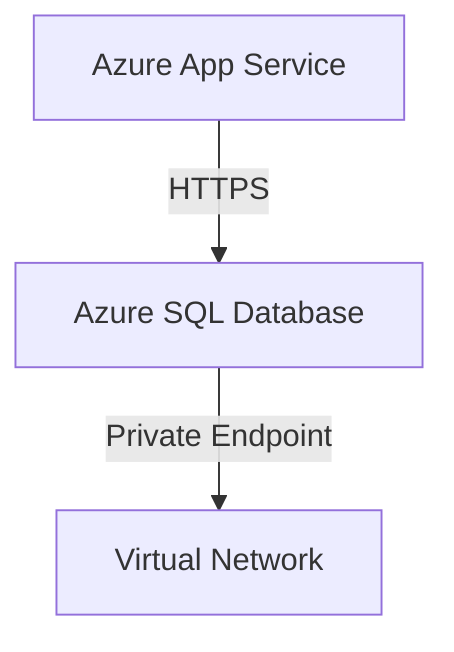
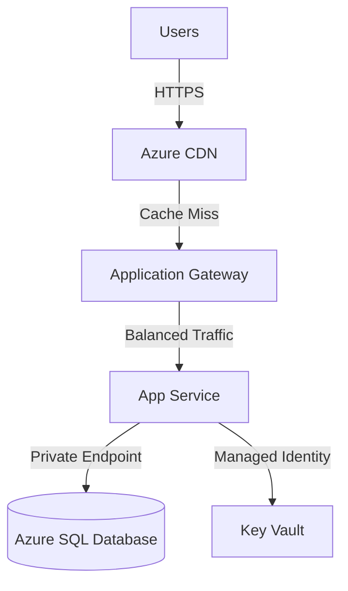

# 🎓 AgentCon Tutorial: Building Agentic AI from Scratch

**Complete guide to building an Azure Architecture Critic with Microsoft Agent Framework**

This tutorial takes you from "zero to hero" — from installing Python to running a full 4-step agentic AI pipeline.

---

## Table of Contents

1. [Part 0: Environment Setup](#part-0-environment-setup)
2. [Part 1: Single Agent - Architecture Critic](#part-1-single-agent--architecture-critic)
3. [Part 2: Two Agents - Sequential Pipeline](#part-2-two-agents--sequential-pipeline)
4. [Part 3: Factory Pattern - Centralized Agent Creation](#part-3-factory-pattern--centralized-agent-creation)
5. [Part 4: MCP Grounding - Documentation Integration](#part-4-mcp-grounding--documentation-integration)
6. [Part 5: Diagram Visualizer - Mermaid Generation](#part-5-diagram-visualizer--mermaid-generation)
7. [Part 6: IaC Generator - Bicep Code Generation](#part-6-iac-generator--bicep-code-generation)
8. [Part 7: Image Mode - Photo/Whiteboard Analysis](#part-7-image-mode--photowhiteboard-analysis)

---

## Part 0: Environment Setup

### 0.1: Install Python 3.12

**Why Python 3.12?** It's the latest stable version with better performance and type hints support.

**Windows:**
1. Download from [python.org](https://www.python.org/downloads/)
2. Check "Add Python to PATH" during installation
3. Verify installation:
```bash
python --version
```

**macOS/Linux:**
```bash
# Using Homebrew (macOS)
brew install python@3.12

# Or using apt (Ubuntu)
sudo apt update && sudo apt install python3.12 python3.12-venv
```

### 0.2: Clone the Repository

```bash
git clone https://github.com/your-repo/agentcon-cloud-repo.git
cd agentcon-cloud-repo
```

### 0.3: Create Virtual Environment

**Why a virtual environment?** It isolates project dependencies from your system Python, preventing version conflicts.

```bash
# Create virtual environment
python -m venv .venv

# Activate it
# Windows:
.\.venv\Scripts\Activate.ps1

# macOS/Linux:
source .venv/bin/activate
```

You should see `(.venv)` prefix in your terminal.

### 0.4: Install Dependencies

```bash
pip install -r requirements.txt
```

**What gets installed:**
- `agent-framework==1.0.0b251204` - Microsoft's agentic AI framework
- `openai` - OpenAI API client
- `python-dotenv` - Environment variable management
- `mcp` - Model Context Protocol support

### 0.5: Setup Model Provider (Ollama Recommended)

#### Option A: Ollama (FREE, Local, Recommended)

1. **Install Ollama** from [ollama.ai](https://ollama.ai)

2. **Start the server** (in one terminal):
```bash
ollama serve
```

3. **Pull the model** (in another terminal):
```bash
ollama pull gpt-oss:20b
```

**Why gpt-oss:20b?** It's a 20-billion parameter open-source model that runs locally without API costs and produces excellent results.

**Verify it's working:**
```bash
curl http://localhost:11434/api/tags
```

#### Option B: OpenAI (Production Quality)

1. Get API key from [openai.com](https://openai.com)
2. Set in `.env`:
```env
USE_OPENAI=true
OPENAI_API_KEY=sk-your-key-here
```

#### Option C: Foundry Local (Enterprise)

Quick setup (short): Install Foundry Local via `winget` (Windows) or `brew` (macOS), verify with `foundry --version`, then run a model with `foundry model run qwen2.5-0.5b`.

`.env` example:
```env
USE_FOUNDRY_LOCAL=true
LOCAL_BASE_URL=http://127.0.0.1:56238/v1
LOCAL_MODEL=qwen2.5-0.5b
```

### 0.6: Create and Configure `.env`

```bash
cp .env.example .env
```

For Ollama (default):
```env
USE_OPENAI=false
USE_OLLAMA=true
OLLAMA_BASE_URL=http://localhost:11434/v1
OLLAMA_MODEL=gpt-oss:20b
USE_FOUNDRY_LOCAL=false
```

---

## Part 1: Single Agent - Architecture Critic

### 1.1: Understanding the Concept

**Goal:** Create ONE AI agent that critiques Azure architectures.

**Why this approach?** It's the simplest building block. Before orchestrating multiple agents, we need to understand how ONE agent works.

**Architecture:**
```
User Input (Architecture Text)
         ↓
   Chat Client (OpenAI/Ollama/Foundry)
         ↓
   ChatAgent (Critic Role)
         ↓
   Agent Output (Critique)
```

### 1.2: Create `step1_single_agent.py`

Start with imports — these bring in everything we need:

```python
"""Step 1: Single Agent Critic - Build the simplest working unit"""
import asyncio
import os
from dotenv import load_dotenv
from agent_framework import ChatAgent
from agent_framework.openai import OpenAIChatClient
```

**Explanation:**
- `asyncio` - Enables async/await for non-blocking I/O (agents stream responses)
- `os` - Access environment variables
- `load_dotenv()` - Loads `.env` file variables
- `ChatAgent` - Core agent class from Microsoft Agent Framework
- `OpenAIChatClient` - Works with OpenAI-compatible APIs (OpenAI, Ollama, Foundry)

```python
load_dotenv()
```

**Why?** Loads API keys and configuration from `.env` file safely (don't hardcode secrets!).

### 1.3: Create Provider Detection Function

```python
def create_chat_client():
    """Create chat client from configured provider (OpenAI, Ollama, or Foundry Local)"""
    use_openai = os.getenv("USE_OPENAI", "false").lower() == "true"
    use_ollama = os.getenv("USE_OLLAMA", "false").lower() == "true"
    
    if use_openai:
        model = os.getenv("OPENAI_MODEL", "gpt-4o-mini")
        api_key = os.getenv("OPENAI_API_KEY")
        print(f"🤖 Using OpenAI model: {model}")
        return OpenAIChatClient(api_key=api_key, model_id=model)
    elif use_ollama:
        model = os.getenv("OLLAMA_MODEL", "gpt-oss:20b")
        base_url = os.getenv("OLLAMA_BASE_URL", "http://localhost:11434/v1")
        print(f"🤖 Using Ollama model: {model}")
        return OpenAIChatClient(
            api_key="dummy",  # Ollama doesn't require API key
            model_id=model,
            base_url=base_url  # Point to local Ollama server
        )
    else:
        model = os.getenv("LOCAL_MODEL", "gpt-oss-20b-generic-cpu:1")
        base_url = os.getenv("LOCAL_BASE_URL", "http://localhost:56238/v1")
        print(f"🤖 Using Foundry Local model: {model}")
        return OpenAIChatClient(api_key="dummy", model_id=model, base_url=base_url)
```

**Why this pattern?**
- **Single source of truth** - One place to handle all 3 providers
- **Environment-driven** - Change provider by editing `.env`, no code changes
- **Fallback defaults** - Each provider has a default model
- **Flexibility** - Easy to add more providers later

### 1.4: Create the Main Function

```python
async def main():
    """Single agent that critiques Azure architecture"""
    
    # Initialize chat client (auto-detects provider from env vars)
    chat_client = create_chat_client()
```

**Why `async`?** Agent Framework uses async/await to stream responses as they're generated (much faster than waiting for full response).

### 1.5: Create the ChatAgent

```python
    # Create a Critic agent
    critic = ChatAgent(
        chat_client=chat_client,
        instructions="""You are an Azure Architecture Critic. 
Review the architecture for:
- Security issues
- Wrong service choices
- Missing best practices
Keep your critique brief with bullet points.""",
        name="architecture_critic"
    )
```

**Explanation:**
- `chat_client` - The LLM backend (OpenAI/Ollama/Foundry)
- `instructions` - The system prompt (tells agent its role and how to behave)
- `name` - Identifier for logging/debugging

**Why this prompt?** 
- Specific role ("Azure Architecture Critic")
- Clear format ("bullet points")
- Actionable scope (security, service choices, best practices)

### 1.6: Define Input Architecture

```python
    # Input architecture (flawed on purpose)
    architecture = """
    We have a 3-tier e-commerce application on Azure:
    - Frontend: Virtual Machines running Node.js (public IPs)
    - Backend: Virtual Machines running .NET APIs (public IPs)
    - Database: Azure SQL Database (public endpoint enabled)
    - Storage: Azure Storage Account (no encryption at rest)
    """
```

**Why these flaws?** 
- Public IPs exposed - major security risk
- Unencrypted storage - compliance failure
- Using VMs instead of managed services - cost inefficiency

The agent should catch all of these.

### 1.7: Display and Run

```python
    print("="*60)
    print("🎯 INPUT ARCHITECTURE")
    print("="*60)
    print(architecture)
    
    # Run the critic
    print("\n" + "="*60)
    print("🔍 ARCHITECTURE CRITIQUE")
    print("="*60)
    response = await critic.run(architecture)
    print(response.text)
```

**Why display input?** Helps users understand what the agent is analyzing.

### 1.8: Entry Point

```python
if __name__ == "__main__":
    asyncio.run(main())
```

**Why this pattern?** 
- `asyncio.run()` starts the async event loop
- `if __name__ == "__main__"` ensures code only runs when script is executed directly

### 1.9: Run It

```bash
python step1_single_agent.py
```

**Expected Output:**
```
🤖 Using Ollama model: gpt-oss:20b
============================================================
🎯 INPUT ARCHITECTURE
============================================================
We have a 3-tier e-commerce application on Azure:
...

============================================================
🔍 ARCHITECTURE CRITIQUE
============================================================
**Security Issues:**
- ❌ Public IPs exposed on frontend and backend VMs
- ❌ Azure SQL Database public endpoint enabled
- ❌ No encryption at rest for storage account
...
```

---

## Part 2: Two Agents - Sequential Pipeline

### 2.1: Why Two Agents?

**Problem with Step 1:** One agent critiques, but doesn't fix. Real value comes from:
1. **Identify problems** (Critic agent)
2. **Solve problems** (Fixer agent)

**Architecture:**
```
Input Architecture
      ↓
  Critic Agent → Critique Output
      ↓
  Fixer Agent ← Receives both original + critique
      ↓
  Improved Architecture
```

### 2.2: Add Helper Function

```python
def get_text(response):
    """Extract text from agent response"""
    return response.text if hasattr(response, 'text') and response.text else ""
```

**Why?** Agent responses have `.text` attribute, but we need to safely extract it.

### 2.3: Create Both Agents

```python
async def main():
    """Sequential pipeline: Critic finds problems, Fixer solves them"""
    
    chat_client = create_chat_client()
    
    # Agent 1: Critic
    critic = ChatAgent(
        chat_client=chat_client,
        instructions="""You are an Azure Architecture Critic. 
Review for: security issues, wrong service choices, missing best practices.
Keep brief with bullet points.""",
        name="critic"
    )
    
    # Agent 2: Fixer
    fixer = ChatAgent(
        chat_client=chat_client,
        instructions="""You are an Azure Architecture Fixer.
Improve the architecture by:
- Applying Azure Well-Architected Framework
- Using managed services over IaaS
- Implementing secure-by-default networking
Output: improved architecture description.""",
        name="fixer"
    )
```

**Key differences from Step 1:**
- Fixer gets different instructions (focused on improvement, not critique)
- Both agents use same `chat_client` backend

### 2.4: Run Sequential Pipeline

```python
    architecture = """..."""  # Same flawed architecture as Step 1
    
    # Step 1: Critic
    print("\n" + "="*60)
    print("🔍 STEP 1: Architecture Critic")
    print("="*60)
    critique_response = await critic.run(architecture)
    critique = get_text(critique_response)
    print(critique)
    
    # Step 2: Fixer
    print("\n" + "="*60)
    print("🔧 STEP 2: Architecture Fixer")
    print("="*60)
    fixer_input = f"Original:\n{architecture}\n\nCritique:\n{critique}"
    fixer_response = await fixer.run(fixer_input)
    improved = get_text(fixer_response)
    print(improved)
```

**Key concept:** Fixer gets THREE pieces of info:
1. Original architecture (what we started with)
2. Critique (what's wrong)
3. Implicit knowledge from instructions (how to fix)

This gives the Fixer complete context.

---

## Part 3: Factory Pattern - Centralized Agent Creation

### 3.1: Why Factory Pattern?

**Problem:** Step 2 creates agents inline. But what if we have 5+ agents? Code gets messy:

```python
# ❌ Bad - repeated code
critic = ChatAgent(chat_client, instructions="...", name="critic")
fixer = ChatAgent(chat_client, instructions="...", name="fixer")
visualizer = ChatAgent(chat_client, instructions="...", name="visualizer")
# ... keep repeating
```

**Solution:** Use Factory Pattern — ONE place to create all agents:

```python
# ✅ Good - centralized
factory = AgentFactory(chat_client)
critic = factory.create_agent("critic")
fixer = factory.create_agent("fixer")
visualizer = factory.create_agent("visualizer")
```

### 3.1.1: Factory Pattern

Real-world analogy:

- Imagine building a house and needing doors. You can either learn carpentry, buy materials, and build each door yourself (messy and repetitive), or you can order finished doors from a door factory and have them delivered — consistent, fast, and no carpentry required.

In plain words:

- A factory centralizes creation: clients ask for a ready-made object and don't need to know how it's built.

How this maps to our project:

- "Door factory" → `AgentFactory` (builds agents)
- "Door types" → agent roles like `critic`, `fixer`, `visualizer`
- "Materials & tools" → `chat_client`, `mcp_tool`, and config flags

Benefits in our code:

- Single place to change prompts, tools, or provider logic
- Avoids repeating `ChatAgent(...)` construction everywhere
- Makes adding new agent roles one small change (add prompt + role)

Short programmatic view:

- Client code: `factory.create_agent("critic")` (asks for a ready agent)
- Factory: knows how to wire `chat_client`, tools, and flags into each `ChatAgent`

This keeps the pipeline clean and the instantiation logic centralized and testable.

### 3.2: Create AgentFactory Class

```python
class AgentFactory:
    """Factory pattern: centralized agent creation with multi-provider support"""
    
    def __init__(self, chat_client: OpenAIChatClient):
        self.chat_client = chat_client
        self.model_supports_copilot_messages = os.getenv("USE_OPENAI", "false").lower() == "true"
```

**Explanation:**
- `__init__()` - Constructor, receives the chat_client
- `model_supports_copilot_messages` - Flag for whether model supports Copilot-style multi-channel responses (OpenAI yes, Ollama/Foundry no)

### 3.3: Define All Prompts in One Place

```python
        self.prompts = {
            "critic": """You are an Azure Architecture Critic. 
Review for: security issues, wrong service choices, missing best practices.
Keep brief with bullet points.""",
            
            "fixer": """You are an Azure Architecture Fixer.
Improve the architecture by:
- Applying Azure Well-Architected Framework
- Using managed services over IaaS
- Implementing secure-by-default networking
Output: improved architecture description."""
        }
```

**Why?** 
- Centralized - Change any prompt once and it's updated everywhere
- Readable - See all prompts together
- Maintainable - Easy to add new roles

### 3.4: Implement create_agent Method

```python
    def create_agent(self, role: str) -> ChatAgent:
        """Create an agent by role - no duplication"""
        return ChatAgent(
            chat_client=self.chat_client,
            instructions=self.prompts[role],
            name=role,
            model_supports_copilot_messages=self.model_supports_copilot_messages
        )
```

**Key point:** `model_supports_copilot_messages=self.model_supports_copilot_messages` tells the Agent Framework how to parse responses:
- OpenAI models return Copilot-style multi-channel messages
- Ollama/Foundry models return raw text

### 3.5: Use the Factory

```python
async def main():
    chat_client = create_chat_client()
    factory = AgentFactory(chat_client)
    
    # Now creating agents is one-liners
    critic = factory.create_agent("critic")
    fixer = factory.create_agent("fixer")
    
    # Rest of pipeline...
```

**Benefit:** Code is DRY (Don't Repeat Yourself). Easier to maintain and extend.

---

## Part 4: MCP Grounding - Documentation Integration

### 4.1: What is MCP? Why Do We Need It?

**Problem with Step 3:** Agents can hallucinate. They might suggest:
- Non-existent Azure services
- Wrong resource type names
- Outdated best practices

**Solution:** Use Model Context Protocol (MCP) to ground agents in **real documentation**.

**Architecture:**
```
Agent Question
      ↓
MCP Tool → Query Microsoft Learn API
      ↓
Real Documentation Retrieved
      ↓
Agent's Answer (Grounded in Facts)
```

### 4.2: Add MCP Import

```python
from agent_framework import ChatAgent, MCPStreamableHTTPTool
```

### 4.3: Initialize MCP Tool

```python
async def main():
    chat_client = create_chat_client()
    
    print("🔌 Connecting to Microsoft Learn MCP...")
    
    async with MCPStreamableHTTPTool(
        name="microsoft_learn",
        url="https://learn.microsoft.com/api/mcp?maxTokenBudget=3000"
    ) as mcp_tool:
        print("✅ MCP connected!\n")
        
        factory = AgentFactory(chat_client, mcp_tool)
```

**Explanation:**
- `MCPStreamableHTTPTool` - Connects to Microsoft Learn documentation
- `maxTokenBudget=3000` - Limit documentation chunks to 3000 tokens (cost control)
- `async with` - Ensures proper cleanup when done

### 4.4: Update AgentFactory to Support Tools

```python
class AgentFactory:
    def __init__(self, chat_client: OpenAIChatClient, mcp_tool: MCPStreamableHTTPTool):
        self.chat_client = chat_client
        self.mcp_tool = mcp_tool
        self.model_supports_copilot_messages = os.getenv("USE_OPENAI", "false").lower() == "true"
        self.supports_tools = os.getenv("USE_OPENAI", "false").lower() == "true"
```

**Why `supports_tools`?**
- OpenAI: Supports function calling (can invoke tools)
- Ollama/Foundry GPT-OSS: Don't support function calling

### 4.5: Update create_agent to Pass Tools

```python
    def create_agent(self, role: str) -> ChatAgent:
        # Only add tools if model supports them (and not for visualizer)
        tools = [self.mcp_tool] if (self.supports_tools and role != "visualizer") else []
        
        return ChatAgent(
            chat_client=self.chat_client,
            instructions=self.prompts[role],
            name=role,
            tools=tools,
            model_supports_copilot_messages=self.model_supports_copilot_messages
        )
```

### 4.6: Updated Prompts to Use MCP

```python
self.prompts = {
    "critic": """You are an Azure Architecture Critic.
Review for: security issues, wrong service choices, missing best practices.
**Use the Microsoft Learn MCP tool** to cite official Azure documentation.
Keep brief with bullet points and cite sources.""",
    
    "fixer": """You are an Azure Architecture Fixer.
Improve the architecture by:
- Applying Azure Well-Architected Framework
- Using managed services over IaaS
- Implementing secure-by-default networking
**Use the Microsoft Learn MCP tool** to reference official guidance.
Output: improved architecture with documentation links."""
}
```

**Key change:** Prompts now explicitly ask agents to use MCP tool.

### 4.7: Result

Now agent responses include citations:
```
Security Issues:
- ❌ Public IPs exposed on VMs
  Reference: https://learn.microsoft.com/en-us/azure/security/...
  
- ❌ SQL Database public endpoint enabled  
  Best Practice: https://learn.microsoft.com/en-us/azure/sql-database/...
```

---

## Part 5: Diagram Visualizer - Mermaid Generation

### 5.1: Why Add a Visualizer?

**Problem:** Architectures are hard to understand as text alone.

**Solution:** Generate Mermaid diagrams that can be:
- Viewed on GitHub
- Shared with teams
- Used in documentation

### 5.2: Add Visualizer Role

```python
self.prompts = {
    # ... critic, fixer as before ...
    
    "visualizer": """You are a Mermaid Diagram Generator.
Generate a **valid Mermaid syntax** diagram of the Azure architecture.
Use Mermaid graph notation with Azure service icons.
Example:

Use proper Azure service names. Include all components and connections."""
}
```

**Key points:**
- Very specific format (Mermaid syntax)
- Example provided in prompt
- Service names must be exact

### 5.3: Update create_agent to Exclude Visualizer from Tools

```python
    def create_agent(self, role: str) -> ChatAgent:
        # Visualizer doesn't need MCP (pure generation task)
        tools = [self.mcp_tool] if (self.supports_tools and role != "visualizer") else []
        
        return ChatAgent(
            chat_client=self.chat_client,
            instructions=self.prompts[role],
            name=role,
            tools=tools,
            model_supports_copilot_messages=self.model_supports_copilot_messages
        )
```

**Why exclude Visualizer?** It doesn't need to research documentation — it just converts architecture to diagram syntax.

### 5.4: Add Visualizer to Pipeline

```python
async def main():
    # ... create critic, fixer as before ...
    
    # Step 3: Visualizer
    print("\n" + "="*60)
    print("📊 STEP 3: Diagram Visualizer")
    print("="*60)
    visualizer = factory.create_agent("visualizer")
    diagram_response = await visualizer.run(improved)
    diagram = get_text(diagram_response)
    print(diagram)
    print("\n💡 Tip: Copy the Mermaid code and paste into: https://mermaid.live")
```

### 5.5: Result

Agent outputs valid Mermaid:


Users can paste into [mermaid.live](https://mermaid.live) to visualize.

---

## Part 6: IaC Generator - Bicep Code Generation

### 6.1: Why Infrastructure as Code?

**Problem:** Manual infrastructure is error-prone and undocumentable.

**Solution:** Use Bicep (Azure's infrastructure as code language) to:
- Define resources as code
- Version control infrastructure
- Automate deployments
- Ensure consistency

### 6.2: Add IaC Generator Role

```python
self.prompts = {
    # ... previous roles ...
    
    "iac_generator": """You are a Bicep IaC Generator.
Generate **Azure Bicep code** to deploy the improved architecture.
Include:
- Resource definitions (App Service, SQL, VNet, etc.)
- Secure configurations (Private Endpoints, managed identities)
- Parameters and outputs
**Use Microsoft Learn MCP tool** for Bicep best practices and syntax.
Output: Production-ready Bicep code with comments."""
}
```

### 6.3: Add IaC Step to Pipeline

```python
    # Step 4: IaC Generator
    print("\n" + "="*60)
    print("📝 STEP 4: Bicep IaC Generator")
    print("="*60)
    iac_generator = factory.create_agent("iac_generator")
    iac_response = await iac_generator.run(improved)
    bicep_code = get_text(iac_response)
    print(bicep_code)
```

### 6.4: Example Output

Agent generates valid Bicep:
```bicep
param location string = resourceGroup().location
param appName string = 'myapp'

resource vnet 'Microsoft.Network/virtualNetworks@2023-02-01' = {
  name: '${appName}-vnet'
  location: location
  properties: {
    addressSpace: {
      addressPrefixes: [
        '10.0.0.0/16'
      ]
    }
  }
}

resource appService 'Microsoft.Web/sites@2023-01-01' = {
  name: '${appName}-app'
  location: location
  kind: 'app'
  identity: {
    type: 'SystemAssigned'
  }
  properties: {
    serverFarmId: appServicePlan.id
  }
}
```

### 6.5: Usage

```bash
# Save to file
cat > main.bicep << 'EOF'
[paste agent output here]
EOF

# Deploy
az deployment group create \
  --resource-group myResourceGroup \
  --template-file main.bicep
```

---

## Part 7: Image Mode - Photo/Whiteboard Analysis

### 7.1: Why Image Mode?

**Scenario:** Architect sketches architecture on whiteboard, takes photo. We want to:
1. Convert image → text description
2. Run full pipeline on that text

### 7.2: Add Image Processing

```python
from agent_framework import ChatAgent, MCPStreamableHTTPTool, UriContent, DataContent, ChatMessage
```

**New imports:**
- `UriContent` - For remote images (URLs)
- `DataContent` - For local image files
- `ChatMessage` - Wrapper for multimodal content

### 7.3: Add Diagram Interpreter Role

```python
self.prompts = {
    "diagram_interpreter": """You are an Architecture Diagram Interpreter.
Extract a **detailed text description** of the Azure architecture from the image.
Identify:
- Azure services shown (VMs, databases, networks, etc.)
- Connections and data flow
- Security configurations (public vs private)
- Any annotations or notes
Output: Clear text description of the architecture.""",
    
    # ... other roles ...
}
```

### 7.4: Create Image Processing Function

```python
async def run_image_mode(factory: AgentFactory, image_path: str):
    """Process architecture from image file"""
    
    # Step 0: Interpret diagram image → text description
    print("="*60)
    print("📸 STEP 0: Diagram Interpreter (Image → Text)")
    print("="*60)
    interpreter = factory.create_agent("diagram_interpreter")
    
    # Handle both local files and URLs
    if image_path.startswith(("http://", "https://")):
        # Remote image - use UriContent
        image_content = UriContent(uri=image_path, media_type="image/png")
    else:
        # Local file - read and encode as DataContent
        with open(image_path, "rb") as f:
            image_data = f.read()
        image_content = DataContent(data=image_data, media_type="image/png")
    
    # Wrap image content in a ChatMessage and pass to agent
    message = ChatMessage(role="user", contents=[image_content])
    response = await interpreter.run(message)
    architecture_text = get_text(response)
    print(architecture_text)
    
    return architecture_text
```

**Explanation:**
- **Check if URL or local file** - Different handling for each
- **Read image data** - Convert local file to bytes
- **Wrap in ChatMessage** - Agent Framework needs this format
- **Return text** - Pass to rest of pipeline

### 7.5: Update Main to Support Image Mode

```python
async def main():
    chat_client = create_chat_client()
    
    print("🔌 Connecting to Microsoft Learn MCP...")
    
    async with MCPStreamableHTTPTool(
        name="microsoft_learn",
        url="https://learn.microsoft.com/api/mcp?maxTokenBudget=3000"
    ) as mcp_tool:
        print("✅ MCP connected!\n")
        
        factory = AgentFactory(chat_client, mcp_tool)
        
        # Check for image input
        image_path = os.getenv("ARCHITECTURE_IMAGE_PATH")
        
        if image_path and Path(image_path).exists():
            # IMAGE MODE: Process photo/whiteboard
            print("🖼️  IMAGE MODE: Processing architecture diagram...\n")
            architecture_text = await run_image_mode(factory, image_path)
            # Then run rest of pipeline on extracted text
            await run_text_pipeline(factory, architecture_text, skip_input_display=True)
        else:
            # TEXT MODE: Use provided architecture text
            print("📝 TEXT MODE (default)")
            architecture = """..."""
            await run_text_pipeline(factory, architecture, skip_input_display=False)
```

### 7.6: Enable Image Mode in .env

```env
USE_IMAGE_MODE=true
ARCHITECTURE_IMAGE_PATH=images/my-architecture.png
```

Or use a URL:
```env
USE_IMAGE_MODE=true
ARCHITECTURE_IMAGE_PATH=https://example.com/diagram.png
```

---

## Complete Flow Visualization

```
┌─────────────────────────────────────────────────────────┐
│ INPUT                                                    │
│  • Text description OR diagram image                    │
└─────────────────────────────────────────────────────────┘
                            ↓
        ┌──────────────────────────────────────┐
        │ STEP 0: Diagram Interpreter (if image)
        │  • Converts image → structured text  │
        │  • No MCP needed                     │
        └──────────────────────────────────────┘
                            ↓
        ┌──────────────────────────────────────┐
        │ STEP 1: Architecture Critic (MCP)    │
        │  • Identifies security gaps          │
        │  • Detects wrong service choices     │
        │  • Cites Microsoft Learn docs        │
        └──────────────────────────────────────┘
                            ↓
        ┌──────────────────────────────────────┐
        │ STEP 2: Architecture Fixer (MCP)     │
        │  • Applies Well-Architected Framework
        │  • Prefers managed services over IaaS
        │  • Validates against Microsoft Learn │
        └──────────────────────────────────────┘
                            ↓
        ┌──────────────────────────────────────┐
        │ STEP 3: Diagram Visualizer           │
        │  • Generates Mermaid diagram syntax  │
        │  • No MCP needed                     │
        └──────────────────────────────────────┘
                            ↓
        ┌──────────────────────────────────────┐
        │ STEP 4: IaC Generator (MCP)          │
        │  • Generates Bicep code              │
        │  • References Bicep best practices   │
        │  • Production-ready output           │
        └──────────────────────────────────────┘
                            ↓
┌─────────────────────────────────────────────────────────┐
│ OUTPUT                                                   │
│  • Critique + Improved Architecture                    │
│  • Mermaid Diagram (view on GitHub/Mermaid Live)      │
│  • Grounded Bicep Code                                │
│  • All saved to output/*.txt files                    │
└─────────────────────────────────────────────────────────┘
```

---

## Key Concepts Summary

### 1. **Async/Await**
- Agents stream responses asynchronously
- Don't wait for full response, process as it arrives
- `async def` functions use `await` for other async operations

### 2. **Factory Pattern**
- Centralize agent creation
- Store all prompts in one place
- Easy to add new roles/agents

### 3. **MCP Grounding**
- Ground AI responses in real documentation
- Prevents hallucinations
- All recommendations cited from official sources

### 4. **Sequential Pipeline**
- Agent 1 output becomes Agent 2 input
- Each agent builds on previous context
- Produces better results than single agent

### 5. **Multi-Provider Support**
- Same code works with OpenAI, Ollama, Foundry
- Switch via environment variables
- No code changes needed

### 6. **Tool Integration**
- Some models support function calling (OpenAI)
- Others need prompting (Ollama/Foundry)
- Framework handles both transparently

---

## Advanced Tips

### Customizing Prompts

Edit prompts in `AgentFactory.prompts` dict:

```python
self.prompts["critic"] = """Your custom prompt here. 
Be specific about what you want the agent to do."""
```

### Adding New Roles

1. Add to `prompts` dict:
```python
self.prompts["compliance_checker"] = """Check for compliance..."""
```

2. Create agent:
```python
compliance = factory.create_agent("compliance_checker")
```

3. Use in pipeline:
```python
await compliance.run(architecture)
```

### Streaming Responses

Instead of `await agent.run()`, use streaming:

```python
async for chunk in agent.run_stream(input_text):
    if chunk.text:
        print(chunk.text, end="", flush=True)  # Print as it arrives
```

### Error Handling

```python
try:
    response = await agent.run(input_text)
except Exception as e:
    print(f"❌ Agent error: {e}")
    # Handle gracefully
```

---

## Troubleshooting

### "Connection refused" to Ollama

**Problem:** `Unable to connect to http://localhost:11434/v1`

**Solution:**
```bash
# Check if Ollama is running
ollama serve

# Check if model is available
ollama list

# Pull model if missing
ollama pull gpt-oss:20b
```

### OpenAI API errors

**Problem:** `Invalid API key`

**Solution:**
```bash
# Check .env has correct key
echo $OPENAI_API_KEY

# Verify key format (should start with sk-)
# Check key hasn't expired on https://platform.openai.com
```

### Agent returns empty response

**Problem:** `response.text` is empty

**Solution:**
```python
# Use get_text helper
response = await agent.run(input_text)
text = get_text(response)  # Handles empty case
```

---

## Next Steps

1. ✅ **Part 1** - Understand single agent
2. ✅ **Part 2** - Build sequential pipelines
3. ✅ **Part 3** - Learn factory pattern for scale
4. ✅ **Part 4** - Ground in real documentation
5. ✅ **Part 5** - Visualize with diagrams
6. ✅ **Part 6** - Generate infrastructure code
7. ✅ **Part 7** - Process real diagrams/photos

**You now understand:**
- How to build agentic AI applications
- Multi-provider model support
- Orchestrating agent pipelines
- Grounding AI in documentation
- Generating production-ready code

**Explore further:**
- Add error handling and retries
- Implement caching for faster responses
- Build web UI with Streamlit/FastAPI
- Deploy to cloud (Azure Functions, App Service)
- Integrate with real architectural tools

---

## References

- [Microsoft Agent Framework Docs](https://github.com/Azure/azure-sdk-for-python)
- [Model Context Protocol (MCP)](https://modelcontextprotocol.io/)
- [Azure Well-Architected Framework](https://learn.microsoft.com/en-us/azure/architecture/framework/)
- [Bicep Documentation](https://learn.microsoft.com/en-us/azure/azure-resource-manager/bicep/)
- [Mermaid Diagram Syntax](https://mermaid.js.org/)

---

**Happy Building! 🚀**

Feel free to experiment with different prompts, add new agent roles, and extend the pipeline for your specific needs.
