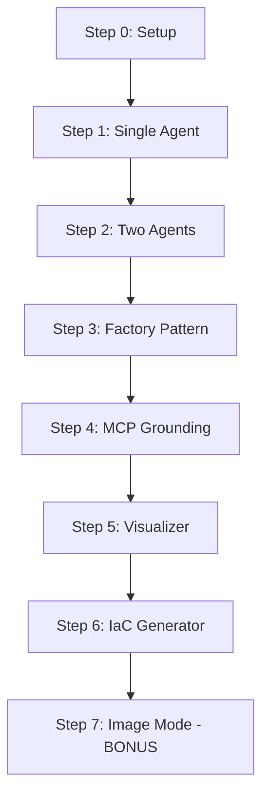

# AgentCon Zürich Workshop: Building Agentic AI Pipelines

**Duration:** 90 minutes | **Level:** Intermediate | **Language:** Python

## Workshop Overview

Learn to build **production-ready AI agent pipelines** using Microsoft Agent Framework and Model Context Protocol (MCP). Transform natural language or images into deployed Azure infrastructure through a multi-agent workflow.

### What You'll Build
A **5-agent pipeline** that:
1. **Critiques** Azure architectures for security/best practices
2. **Fixes** issues using Azure Well-Architected Framework
3. **Visualizes** with Mermaid diagrams
4. **Generates** Infrastructure-as-Code (Bicep)
5. **Processes** images (whiteboard photos → deployment)

### Key Technologies
- **Microsoft Agent Framework** - Multi-agent orchestration
- **Model Context Protocol (MCP)** - Knowledge grounding
- **OpenAI GPT-4o-mini/GPT-5-mini** - Language models
- **Microsoft Learn** - Azure documentation retrieval
- **Azure Bicep** - Infrastructure-as-Code

---

## Prerequisites

### Required Knowledge
- Python 3.11+ basics (async/await, classes, enums)
- Azure fundamentals (services, resource groups)
- Basic understanding of AI/LLMs

### Software Setup
- **Python:** 3.11 or higher ([Download](https://www.python.org/downloads/))
- **VS Code:** Recommended IDE ([Download](https://code.visualstudio.com/))
- **Git:** For cloning the repository ([Download](https://git-scm.com/))
- **OpenAI API Key:** Required for models ([Get key](https://platform.openai.com/api-keys))

### Environment Setup (Before Workshop)
```bash
# Clone repository
git clone <your-repo-url>
cd AgentCon-Cloud-Repo

# Create virtual environment
python -m venv .venv

# Activate (Windows)
.venv\Scripts\activate
# Activate (Mac/Linux)
source .venv/bin/activate

# Install dependencies
pip install -r requirements.txt

# Configure API key
echo OPENAI_API_KEY=your-key-here > .env
echo OPENAI_MODEL=gpt-4o-mini >> .env
```

---

## Workshop Structure

### 📋 Step 0: Setup & Intro (0-10 min)
- Verify environment setup
- Introduction to Microsoft Agent Framework
- Overview of multi-agent patterns

**Checkpoint:** Run `python --version` and verify API key

---

### 🤖 Step 1: Single Agent (10-25 min)
**Folder:** [`workshop/step1_single_agent/`](./step1_single_agent/)

**Learn:**
- Create your first AI agent
- Understand agent instructions
- Run simple critique workflow

**Code:**
```python
critic = ChatAgent(
    chat_client=chat_client,
    instructions="You are an Azure Architecture Critic...",
    name="critic"
)
response = await critic.run(architecture)
```

**Key Concepts:**
- `ChatAgent` = LLM + Instructions + Name
- `.run()` executes agent with input
- Response contains agent output

[📖 Full Instructions →](./step1_single_agent/README.md)

---

### 🔗 Step 2: Sequential Pipeline (25-40 min)
**Folder:** [`workshop/step2_two_agents/`](./step2_two_agents/)

**Learn:**
- Chain multiple agents (Critic → Fixer)
- Pass outputs between agents
- Division of labor pattern

**Code:**
```python
critic = ChatAgent(instructions="Find problems...")
fixer = ChatAgent(instructions="Fix problems...")

critique = await critic.run(architecture)
improved = await fixer.run(f"Original: {architecture}\nCritique: {critique}")
```

**Key Concepts:**
- Agent chaining: Output₁ → Input₂
- Specialized roles for complex tasks

[📖 Full Instructions →](./step2_two_agents/README.md)

---

### 🏭 Step 3: Factory Pattern (40-55 min)
**Folder:** [`workshop/step3_factory_pattern/`](./step3_factory_pattern/)

**Learn:**
- Centralize agent creation
- Use enums for type safety
- Eliminate code duplication

**Code:**
```python
class AgentFactory:
    def __init__(self, chat_client):
        self.chat_client = chat_client
        self.prompts = {AgentRole.CRITIC: "...", AgentRole.FIXER: "..."}
    
    def create_agent(self, role: AgentRole) -> ChatAgent:
        return ChatAgent(
            chat_client=self.chat_client,
            instructions=self.prompts[role],
            name=role.value
        )

factory = AgentFactory(chat_client)
critic = factory.create_agent(AgentRole.CRITIC)
```

**Key Concepts:**
- Factory pattern benefits: maintainability, consistency, scalability
- Single source of truth for prompts

[📖 Full Instructions →](./step3_factory_pattern/README.md)

---

### 🔌 Step 4: MCP Grounding (55-70 min)
**Folder:** [`workshop/step4_mcp_grounding/`](./step4_mcp_grounding/)

**Learn:**
- Connect agents to external knowledge (Microsoft Learn)
- Use Model Context Protocol (MCP)
- Ground responses with citations

**Code:**
```python
mcp_tool = MCPStreamableHTTPTool(
    url="https://learn.microsoft.com/api/mcp?maxTokenBudget=3000",
    timeout=30
)
await mcp_tool.initialize()

factory = AgentFactory(chat_client, mcp_tool)
critic = factory.create_agent(AgentRole.CRITIC)  # Now has MCP access
```

**Key Concepts:**
- MCP = External knowledge for agents
- Reduces hallucinations with citations
- Token budget controls retrieval size

[📖 Full Instructions →](./step4_mcp_grounding/README.md)

---

### 📊 Step 5: Visualizer Agent (70-80 min)
**Folder:** [`workshop/step5_visualizer/`](./step5_visualizer/)

**Learn:**
- Add diagram generation agent
- Role-based tool assignment
- Generate Mermaid syntax

**Code:**
```python
class AgentRole(Enum):
    CRITIC = "critic"
    FIXER = "fixer"
    VISUALIZER = "visualizer"  # New role

# Visualizer doesn't need MCP (generates from LLM knowledge)
tools = [self.mcp_tool] if role != AgentRole.VISUALIZER else []
```

**Key Concepts:**
- Specialized agents for generation tasks
- Not all agents need all tools
- Mermaid for text-based diagrams

[📖 Full Instructions →](./step5_visualizer/README.md)

---

### 📝 Step 6: IaC Generator (80-88 min)
**Folder:** [`workshop/step6_iac_generator/`](./step6_iac_generator/)

**Learn:**
- Generate Azure Bicep code
- Complete architecture lifecycle
- From critique to deployment

**Code:**
```python
class AgentRole(Enum):
    CRITIC = "critic"
    FIXER = "fixer"
    VISUALIZER = "visualizer"
    IAC_GENERATOR = "iac_generator"  # New role

iac_generator = factory.create_agent(AgentRole.IAC_GENERATOR)
bicep_code = await iac_generator.run(improved_architecture)
```

**Key Concepts:**
- IaC agent closes design → deployment loop
- Bicep for Azure-native deployments
- MCP provides Bicep syntax guidance

[📖 Full Instructions →](./step6_iac_generator/README.md)

---

### 🖼️ Step 7: Image Mode (88-90 min) - **BONUS**
**Folder:** [`workshop/step7_image_mode/`](./step7_image_mode/)

**Learn:**
- Process images (photos, whiteboards)
- Multimodal AI (vision + text)
- Diagram Interpreter agent

**Code:**
```python
from agent_framework import UriContent

interpreter = factory.create_agent(AgentRole.DIAGRAM_INTERPRETER)
image_uri = Path(image_path).absolute().as_uri()
architecture_text = await interpreter.run(UriContent(uri=image_uri))
```

**Key Concepts:**
- UriContent for image inputs
- Vision-capable agents
- Preprocessing step: Image → Text → Pipeline

[📖 Full Instructions →](./step7_image_mode/README.md)

---

## Workshop Flow



---

## Running Each Step

Each step is **self-contained** and can run independently:

```bash
# Step 1
cd workshop/step1_single_agent
python agentcon_demo.py

# Step 2
cd ../step2_two_agents
python agentcon_demo.py

# Step 3
cd ../step3_factory_pattern
python agentcon_demo.py

# ... and so on
```

---

## Learning Progression

| Step | Complexity | Agents | Tools | Output |
|------|-----------|--------|-------|--------|
| 1 | ⭐ | 1 | None | Text critique |
| 2 | ⭐⭐ | 2 | None | Text critique + fix |
| 3 | ⭐⭐ | 2 | None | Same (refactored) |
| 4 | ⭐⭐⭐ | 2 | MCP | Cited critique + fix |
| 5 | ⭐⭐⭐ | 3 | MCP | + Mermaid diagram |
| 6 | ⭐⭐⭐⭐ | 4 | MCP | + Bicep code |
| 7 | ⭐⭐⭐⭐⭐ | 5 | MCP | Image → Full pipeline |

---

## Troubleshooting

### Common Issues

**1. Import Error: `agent_framework` not found**
```bash
pip install agent-framework-core==1.0.0b251204 --force-reinstall
```

**2. OpenAI API Error: 429 Rate Limit**
- Reduce `maxTokenBudget` in MCP URL (default: 3000)
- Switch to `gpt-4o-mini` (smaller model)
- Wait and retry

**3. MCP Connection Timeout**
```python
# Increase timeout
mcp_tool = MCPStreamableHTTPTool(url="...", timeout=60)
```

**4. Empty Agent Responses**
- Verify API key: `echo %OPENAI_API_KEY%` (Windows) or `echo $OPENAI_API_KEY` (Mac/Linux)
- Check model name in `.env` (must be valid OpenAI model)
- Review agent instructions (must be clear and specific)

---

## Resources

### Documentation
- [Microsoft Agent Framework](https://learn.microsoft.com/agent-framework/) - Official docs
- [Model Context Protocol](https://modelcontextprotocol.io/) - MCP specification
- [Azure Bicep](https://learn.microsoft.com/azure/azure-resource-manager/bicep/) - IaC syntax
- [Mermaid Diagrams](https://mermaid.js.org/) - Diagram syntax

### Tools
- [Mermaid Live Editor](https://mermaid.live/) - Preview diagrams
- [Azure Bicep Playground](https://aka.ms/bicepdemo) - Test Bicep code
- [OpenAI Platform](https://platform.openai.com/) - Manage API keys

### Further Learning
- [Azure Well-Architected Framework](https://learn.microsoft.com/azure/well-architected/) - Architecture guidance
- [Agent Design Patterns](https://learn.microsoft.com/agent-framework/design-patterns) - Advanced patterns
- [MCP Server Development](https://modelcontextprotocol.io/servers) - Build custom sources

---

## What's Next?

After the workshop, explore:

### Production Enhancements
- ✅ **Streaming responses** - Live reasoning display (see main demo)
- ✅ **File saving** - Persist outputs (see main demo)
- ⏳ **Error handling** - Retry logic, fallbacks
- ⏳ **Testing** - Unit tests, integration tests
- ⏳ **Monitoring** - Logging, metrics, alerts

### Advanced Features
- **Cost tracking** - Monitor token usage
- **Parallel execution** - Run independent agents concurrently
- **Human-in-the-loop** - Approval gates
- **Custom MCP sources** - Connect to GitHub, Slack, databases

### Full Demo
Check out [`agentcon_demo.py`](../agentcon_demo.py) in the root folder for the **production-ready version** with:
- Streaming responses (real-time output)
- File saving (timestamped outputs)
- Error handling
- Optimized code (115 lines)

---

## Feedback & Questions

**During Workshop:**
- Raise hand or use chat
- Each step has discussion points

**After Workshop:**
- GitHub Issues: Report bugs or request features
- LinkedIn: Connect with instructor
- AgentCon Community: Continue learning

---

## License

This workshop material is provided for educational purposes as part of AgentCon Zürich.

---

**Happy Building! 🚀**

*From whiteboard sketch to deployed infrastructure in 90 minutes.*
