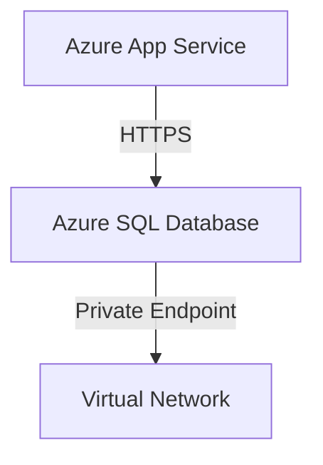
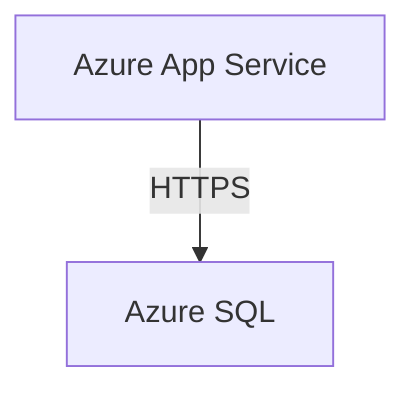

# Step 5: Visualizer Agent

**Duration:** 10 minutes (70-80 min of workshop)

## Learning Objectives
- Add a **visualization agent** to generate diagrams
- Learn **role-based tool assignment** (not all agents need all tools)
- Generate **Mermaid diagram syntax** from architecture text
- Understand **specialized agent roles** (research vs generation)

## Key Concept
**Specialized Agents:** Different agents need different capabilities. The Visualizer **generates diagrams** (no research needed), so it doesn't get the MCP tool. This saves tokens and improves performance.

**Mermaid Diagrams:** Text-based diagramming language supported by GitHub, VS Code, documentation sites. Benefits:
- Version controllable (text format)
- No image tools needed (rendered in browser)
- Easy to edit and maintain

## What's New from Step 4
- Added `VISUALIZER` role to enum
- Role-based tool assignment: `tools = [...] if role != VISUALIZER else []`
- Mermaid-specific prompt with examples
- Third pipeline step: Critic → Fixer → Visualizer

## Run This Step
```bash
cd workshop\step5_visualizer
python agentcon_demo.py
```

## Expected Output
1. Steps 1-2 (Critic + Fixer) run as before
2. **Step 3:** Mermaid diagram code like:


## What's Happening

### Role-Based Tool Assignment
```python
def create_agent(self, role: AgentRole):
    # Conditional tool injection
    tools = [self.mcp_tool] if role != AgentRole.VISUALIZER else []
    
    return ChatAgent(
        instructions=self.prompts[role],
        tools=tools  # Visualizer gets empty tools list
    )
```

**Why?**
- Visualizer generates from LLM knowledge (no retrieval needed)
- Saves MCP API calls and tokens
- Faster response (no tool invocation overhead)

### Visualizer Prompt Engineering
```python
instructions = """You are a Mermaid Diagram Generator.
Generate a **valid Mermaid syntax** diagram...
Example:

Output ONLY valid Mermaid code..."""
```

Key techniques:
- **Explicit format request** ("valid Mermaid syntax")
- **Example provided** (few-shot learning)
- **Output constraint** ("ONLY valid Mermaid code")

## Viewing the Diagram
Copy the Mermaid code and paste into:
1. **https://mermaid.live** - Online editor/viewer
2. **VS Code** - Install Markdown Preview Mermaid Support extension
3. **GitHub/Azure DevOps** - Markdown files auto-render Mermaid

## Discussion Points
- Why not all agents get all tools? (Efficiency, cost, clarity)
- Other visualization formats? (PlantUML, ASCII art, JSON)
- How to validate diagram syntax? (Parsing, rendering tests)
- Production use: Save diagrams to files, version control

## Real-World Applications
- **Architecture documentation:** Auto-generate from IaC code
- **Network diagrams:** Visualize VNets, subnets, peering
- **Data flow:** Show how data moves through system
- **Incident reports:** Diagram affected components

## Next: [Step 6 - IaC Generator →](../step6_iac_generator/)
